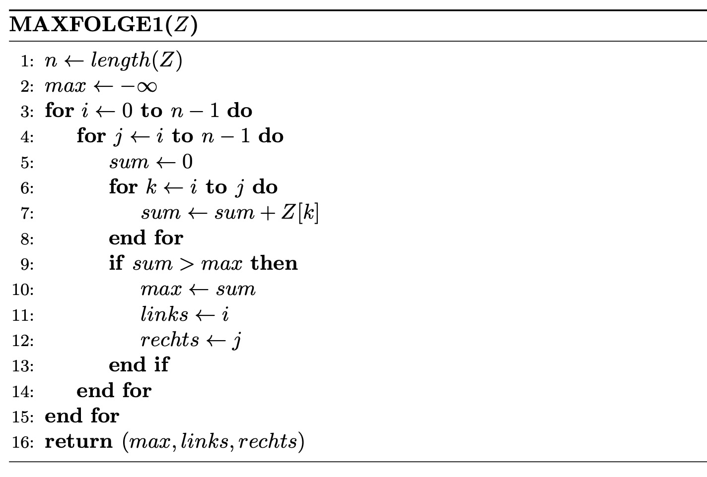
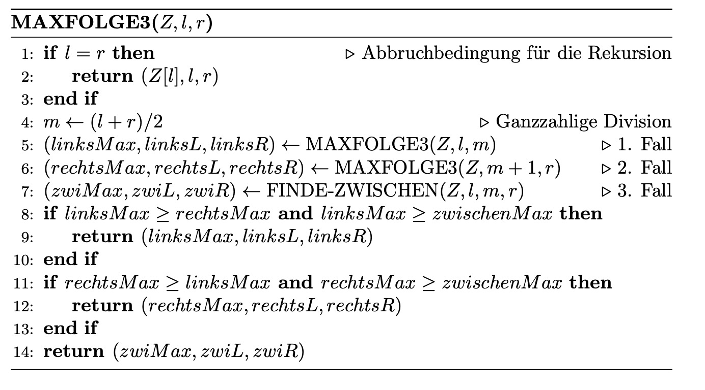
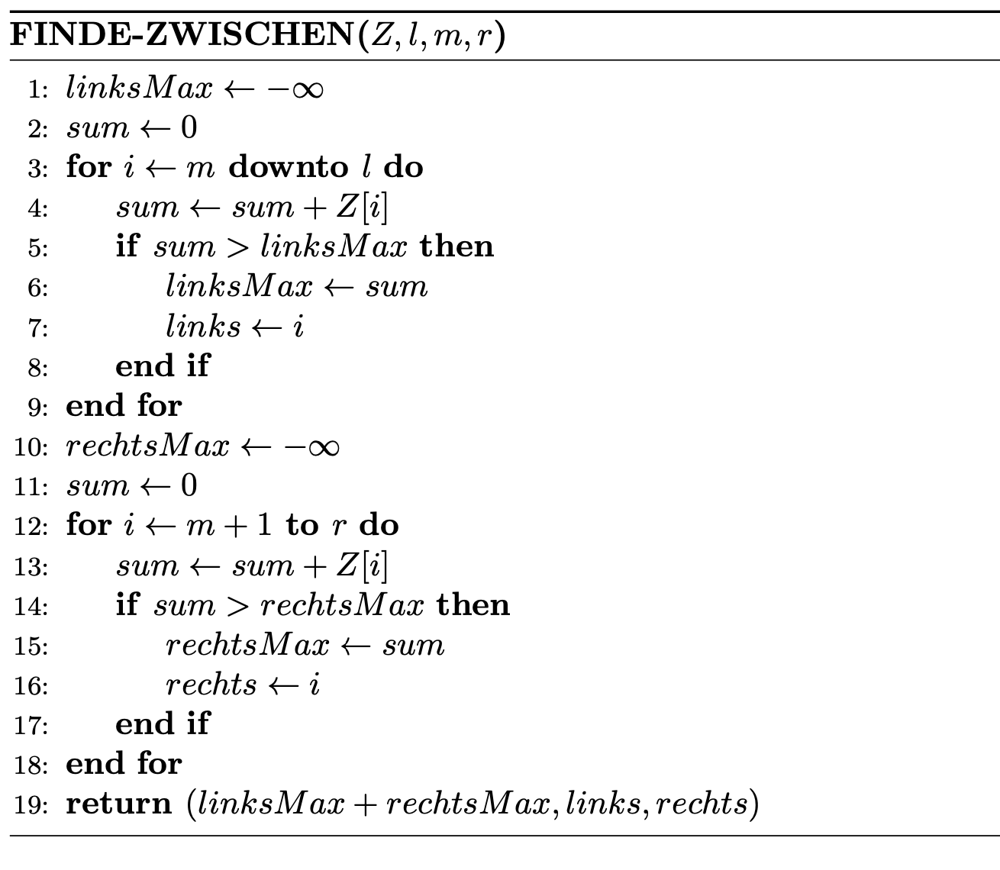
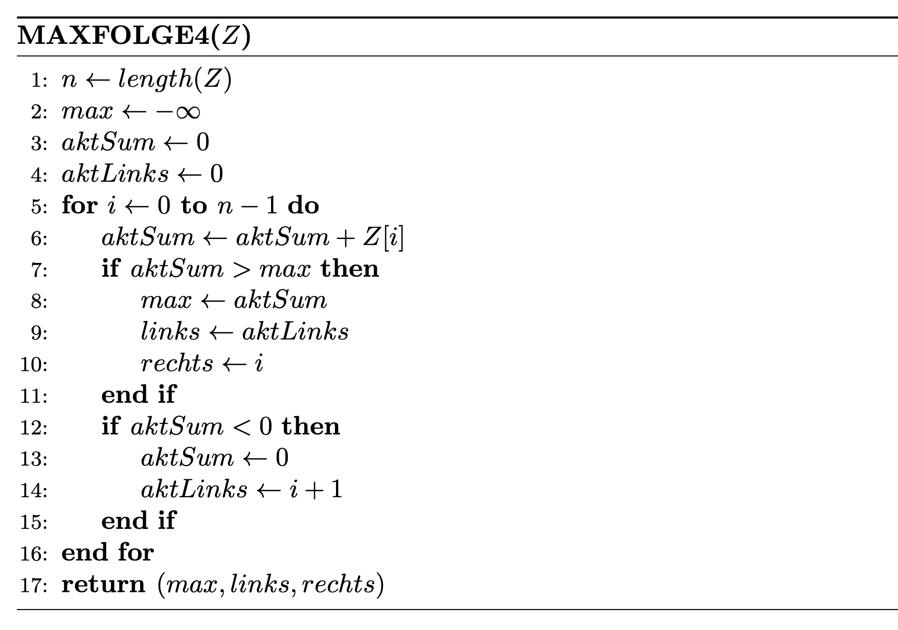
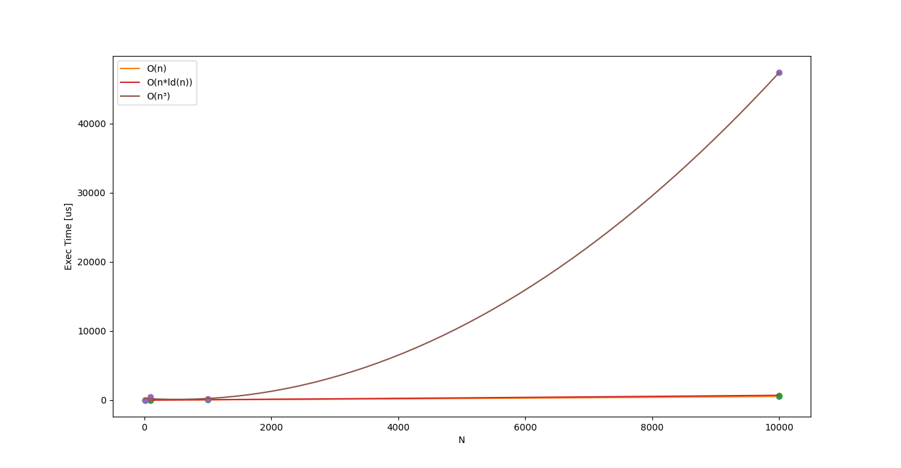

# Praktikum 1: Maximale Abschnittssumme
Es soll die maximale Abschnittssumme für eine Abfolge von n ganzen Zahlen gefunden
werden. Die Zahlen liegen in einem Feld Z mit den Indizes 0 … n−1 im Speicher vor.
Hat man z.B. die Zahlenfolge
```
-59, 52, 46, 14, -50, 58, -87, -77, 34, 15
```
liefert folgende Teil-Zahlenfolge die maximale Abschnittssumme:
```
52 + 46 + 14 + -50 + 58 = 120
```
## Aufgabe 1 - Kubischer Algorithmus
1. Implementieren Sie den betrachteten kubischen Algorithmus und ermitteln Sie für alle
vier Folgen die maximale Abschnittssumme (Wert, linke Grenze, rechte Grenze). 
<p align="center">
  
</p>

### Lösung
```rust
fn calc_partsum(v: &Vec<i8>, sub: &mut Subset)
{
    let n = v.len();
    let mut max : i32 = -128;

    for i in 1..n-1 {
        for j in i..n-1 {
            sub.sum = 0;
            for k in i..j {
                sub.sum += <i8 as Into<i32>>::into(v[k]);
            }
            if sub.sum > max {
                max = sub.sum;
                sub.left = i;
                sub.right = j;
            }
        }
    }
    sub.sum = max;
}
```
### Laufzeit
2) Messen Sie die Laufzeit Ihrer Lösung für die unterschiedlichen Längen der vorgegebenen Folgen.

| N      | Laufzeit |
| ------ | -------- |
| 10    | 0.1 us         |
| 100   | 459 us       |
| 1000  | 209 ms    |
| 10000 | 4738 s |

Das kubische Wachstum konnte durch Messung der Laufzeit bestätigt werden. 
<p align="center">
  
</p>

3) Wodurch können Abweichungen entstehen?

## Aufgabe 2 - Teile-und-Herrsche Algorithmus
1) Implementieren Sie den betrachteten "Teile-und-Herrsche"-Algorithmus (n*ld(n)).
Berechnen Sie ebenfalls die maximalen Abschnittssummen der gegebenen Folgen.
<p align="center">
  
  
</p>

### Lösung
<ins>
MAXFOLGE3:
</ins>

```rust
fn calc_partsum(z:&Vec<i8>, l:usize, r:usize) -> Rets
{
    if l == r {
        return Rets{ max_:<i8 as Into<i32>>::into(z[l]), l_:l, r_:r };
    }

    let m:usize = (l+r)/2;
    let left = calc_partsum(&z,l,m);        // case 1
    let right = calc_partsum(&z,m+1,r);     // case 2
    let middle = find_between(&z,l,m,r);    // case 3

    // left sum was largest
    if left.max_ >= right.max_ && left.max_ >= middle.max_ {
        return left;
    }
    // right sum was largest
    if right.max_ >= left.max_ && right.max_ >= middle.max_ {
        return right;
    }
    // middle sum was largest
    return middle;

}
```
<ins>
FINDE-ZWISCHEN:
</ins>

```rust
fn find_between(z:&Vec<i8>, l:usize, m:usize, r:usize) -> Rets
{
    let mut left = 0;
    let mut right = 0;
    let mut left_max = -128;
    let mut right_max = -128;
    let mut sum = 0;

    for i in (l..m+1).rev() { // careful with bound
        sum += <i8 as Into<i32>>::into(z[i]);
        if sum > left_max {
            left_max = sum;
            left = i;
        }
    }
    sum = 0;
    for i in m+1..r {
        sum += <i8 as Into<i32>>::into(z[i]);
        if sum > right_max {
            right_max = sum;
            right = i;
        }
    }
    return Rets { max_:left_max+right_max, l_:left, r_:right };
}
```

## Aufgabe 3 - linearer Algorithmus
1) Implementieren Sie den betrachteten Algorithmus mit linearer Laufzeit ohne Verwendung eines Arrays/Vektors. 
<p align="center">
  
</p>

### Lösung
```rust
fn calc_partsum_from_file(path: String) -> Rets
{
    let mut max = -128;
    let mut cur_sum : i32 = 0;
    let mut cur_left = 0;
    let mut left = 0;
    let mut right = 0;

    let data = fs::read_to_string(path).expect("Unable to read file");
    let mut i = 0;
    for line in data.lines() {
        cur_sum += line.parse::<i32>().unwrap();
        if cur_sum > max {
            max = cur_sum;
            left = cur_left;
            right = i;
        }
        if cur_sum < 0 {
            cur_sum = 0;
            cur_left = i+1;
        }
        i+=1;
    }

    return Rets{ max_:max, l_:left, r_:right };
}
```

Warum ist das aus Sicht der Effizienz eine gute Idee?

2) Berechnen Sie ebenfalls die maximalen Abschnittssummen der gegebenen Folgen und
vergleichen Sie die Ergebnisse.

| N     | $O(n^3)$ |$O(nld(n))$ |$O(n)$ |
| ----- | ------ | ------ | ------ |
| 10    | 0.1 us | 1 us   | 21 us  |
| 100   | 459 us | 9 us   | 16 us  |
| 1000  | 209 ms | 63 us  | 57 us  |
| 10000 | 4738 s | 703 us | 540 us |
<p align="center">
  
</p>

